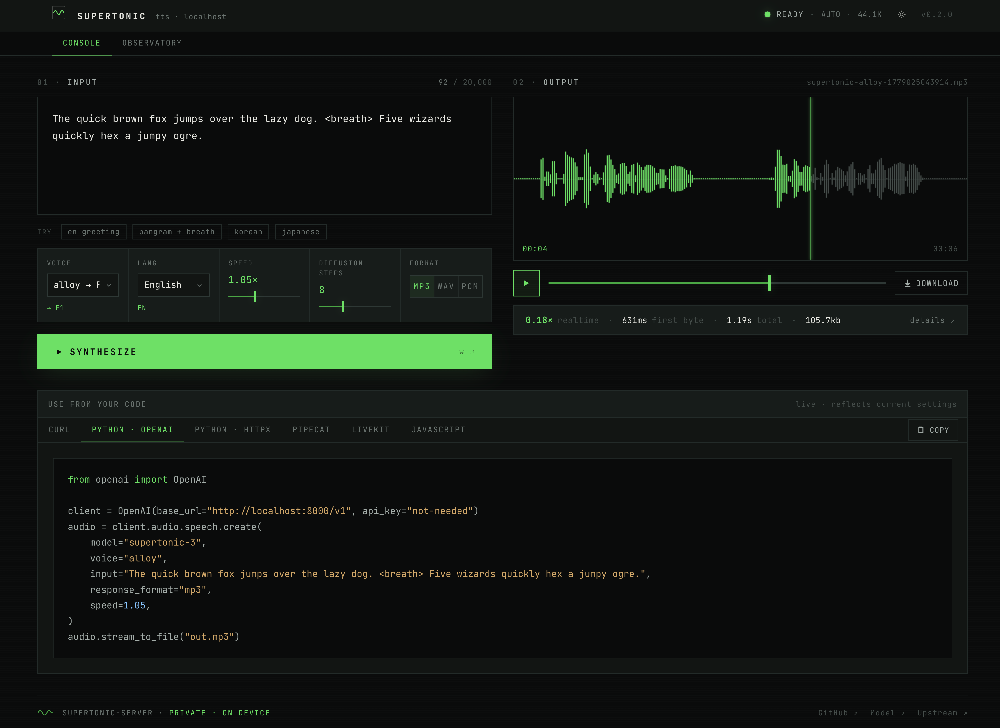

# supertonic-server

> **OpenAI-compatible text-to-speech that runs entirely on your machine.**
> Powered by [Supertonic-3](https://huggingface.co/Supertone/supertonic-3). Streams sentence-by-sentence. Talks to the OpenAI Python SDK, [Pipecat](https://github.com/pipecat-ai/pipecat), LiveKit Agents, OpenWebUI, or anything else that speaks the OpenAI TTS protocol — point it at `http://localhost:8000/v1` and go. Or open `http://localhost:8000/` in your browser and use the built-in console.

[](https://pypi.org/project/supertonic-server/)
[](https://pypi.org/project/supertonic-server/)
[](https://opensource.org/licenses/MIT)
[](https://huggingface.co/Supertone/supertonic-3)

|  |  |  |
|---|---|---|
| **⌂&nbsp; 100% local** | **⌫&nbsp; Drop-in for OpenAI** | **≋&nbsp; ~6–10× real-time** |
| No cloud, no API keys, no telemetry. Runs on CPU, Apple Silicon (CoreML), or NVIDIA (CUDA). | One `base_url` change and your existing OpenAI SDK / Pipecat / LiveKit code keeps working. | ~450 ms first-byte on an M4 Pro. Streams audio before synthesis finishes — perfect for voice agents. |

## Contents

- [At a glance](#at-a-glance) · [vs other open-source TTS servers](#vs-other-open-source-tts-servers)
- [Install](#install) · [Quick start](#quick-start-apple-silicon--linux--windows) · [Web console](#web-console) · [Docker](#docker) · [CLI](#cli)
- [Endpoints](#endpoints) · [WebSocket TTS](#websocket-tts) · [Observability](#observability) · [Voices](#voices) · [Languages](#languages)
- [Use from: Python SDK](#use-it-from-python-openai-sdk) · [Pipecat](#use-it-from-pipecat) · [LiveKit](#use-it-from-livekit-agents)
- [Performance](#performance--what-to-expect) · [Tuning](#tuning) · [Troubleshooting](#troubleshooting)
- [Limitations](#limitations) · [License](#license)

## At a glance

| | Supertonic-3 (via this server) |
|---|---|
| Model size | ~99M params (ONNX) |
| Runtime | ONNX Runtime — runs on **CPU**, CoreML (Apple Silicon), or CUDA |
| Speed | ~6–10× real-time on an M4 Pro CPU/CoreML |
| Languages | 31 + a `na` fallback |
| Voices | 10 presets (F1–F5, M1–M5) + OpenAI aliases (`alloy`, `nova`, `echo`, …) |
| First-byte latency | ~450–650 ms after warmup (default settings) |
| Privacy | Fully local — no cloud calls |
| Transports | OpenAI-compatible HTTP **and** a WebSocket endpoint for voice-agent streaming |
| Observability | In-process ring buffer + Prometheus `/metrics`; live Observatory tab in the web console |
| Web UI | Built-in console at `/`, with live code-snippet panel for curl / OpenAI / Pipecat / LiveKit |
| License | MIT code, OpenRAIL-M weights |

## vs other open-source TTS servers

|  | Local | HTTP stream | WebSocket | Metrics | CPU speed | Languages | Quality | Cost |
|---|:---:|:---:|:---:|:---:|---|:---:|---|---|
| **supertonic-server** (this) | ✅ | sentence | ✅ | `/metrics` + UI | RTF 0.1–0.2 (M-series) | 31 | high | free |
| [Kokoro-FastAPI](https://github.com/remsky/Kokoro-FastAPI) | ✅ | sentence | ❌ | ❌ | RTF 0.3–0.5 | ~8 | high | free |
| [openedai-speech](https://github.com/matatonic/openedai-speech) (Piper) | ✅ | sentence | ❌ | ❌ | RTF 0.05–0.1 | ~30 voices | mid | free |
| [openedai-speech](https://github.com/matatonic/openedai-speech) (XTTS) | ✅ | sentence | ❌ | ❌ | RTF 1.0–2.0 | 17 | high | free |
| ElevenLabs API | ❌ | yes | ✅ | n/a (cloud) | n/a (cloud) | 29+ | top | paid |
| OpenAI TTS API | ❌ | yes | Realtime API | n/a (cloud) | n/a (cloud) | 100+ | high | paid |

"HTTP stream = sentence" means audio is emitted to the client as each sentence finishes synthesizing — what Pipecat and LiveKit consume natively. The **WebSocket** transport adds a persistent connection with text-delta input and `cancel`-based interruption — useful for LLM → TTS pipelines in voice agents.

## Install

```bash
# pip
pip install supertonic-server

# uv (recommended — fast, isolated)
uv venv --python 3.12
uv pip install supertonic-server
```

Optional extras:

```bash
pip install "supertonic-server[pipecat]"   # adds pipecat-ai for the Pipecat example
pip install "supertonic-server[dev]"       # adds pytest, httpx, openai for development
```

### From source

```bash
git clone https://github.com/ARahim3/supertonic-server.git
cd supertonic-server
uv venv --python 3.12
uv pip install -e ".[dev]"
```

## Quick start (Apple Silicon / Linux / Windows)

```bash
# 1. Run the server (first run downloads the model — ~250 MB, one-time)
supertonic-server --port 8000

# 2a. Open the web console
open http://localhost:8000/                   # macOS — or just visit it in your browser

# 2b. …or call it directly
curl -X POST http://localhost:8000/v1/audio/speech \
  -H "Content-Type: application/json" \
  -d '{"input":"Hello, world.","voice":"alloy","response_format":"mp3"}' \
  --output hello.mp3
```

`--device auto` is the default and picks the best available execution provider:
**CUDA** (if `onnxruntime-gpu` is installed and a GPU is present) → **CoreML** (macOS) → **CPU**.

## Web console

Open `http://localhost:8000/` in your browser. Built-in single-page console with two views — **console** (testing voices, tuning parameters, copying ready-to-paste integration snippets) and **observatory** (live server-side metrics; see [Observability](#observability) below).



In the **console** view:

- 13 OpenAI voice aliases (`alloy`, `nova`, `echo`, …) **+** 10 native Supertonic voices (F1-F5, M1-M5), grouped in the picker
- All 31 languages with human names (`English (en)`, `Korean (ko)`, …)
- Speed slider (0.5×–2.0×) and diffusion-step slider (4–16)
- `mp3 · wav · pcm` output format selector
- Streams via HTTP/1.1 chunked transfer; live **TTFB** and bytes-received counter while waiting
- HTML5 audio player with seek + canvas waveform + download button
- Live code-snippet panel — 6 tabs: **curl · Python (OpenAI) · Python (httpx) · Pipecat · LiveKit · JavaScript**

In the **observatory** view:

- Active synthesis count, total requests, requests-per-second (1m window), errors, audio + bytes served
- **p50 / p95 / p99** TTFB and RTF over the recent buffer
- Waterfall feed of recent requests (newest first) with per-row TTFB-vs-stream bar; click any row for full detail
- 1 Hz polling against `/metrics/summary` and `/metrics/recent`; pause toggle to freeze the view

Dark theme is primary; a light-mode toggle persists in `localStorage` along with the active view. Run with `--no-ui` to disable the console route entirely (the API endpoints are unaffected).

## Docker

Two images are shipped — pick the one that matches your hardware. The mounted volume in each example caches the model weights so subsequent starts skip the ~250 MB download.

### CPU image (`Dockerfile`)

Works on every platform — Linux / macOS / Windows containers, x86_64 / arm64. Includes the CPU build of `onnxruntime` only; no CUDA libraries.

```bash
docker build -t supertonic-server .
docker run --rm -p 8000:8000 -v supertonic-cache:/root/.cache supertonic-server
```

The default device is `auto`, which on this image resolves to CPU (CoreML / CUDA execution providers aren't installed). If you pass `-e SUPERTONIC_DEVICE=cuda` here, the server will log a warning and fall back to CPU — use the CUDA image below for real GPU acceleration.

### NVIDIA GPU image (`Dockerfile.cuda`)

Linux-only. Bundles a CUDA 12.4 runtime, cuDNN 9, and `onnxruntime-gpu`. The build step self-checks that `CUDAExecutionProvider` is actually available inside the image, so a broken build fails fast instead of silently running on CPU at runtime.

**Host prerequisites:**

- NVIDIA driver ≥ 545 (any driver compatible with the CUDA 12.4 runtime)
- `nvidia-container-toolkit` installed and registered with the Docker daemon — see [NVIDIA's install guide](https://docs.nvidia.com/datacenter/cloud-native/container-toolkit/latest/install-guide.html)
- Docker Desktop on macOS / Windows **cannot** pass through NVIDIA GPUs; this image is Linux-only

**Sanity-check the host first** (must print your GPU details, not an error):

```bash
docker run --rm --gpus all nvidia/cuda:12.4.1-base-ubuntu22.04 nvidia-smi
```

**Then build and run:**

```bash
docker build -f Dockerfile.cuda -t supertonic-server:cuda .

docker run --rm --gpus all -p 8000:8000 \
  -v supertonic-cache:/root/.cache \
  supertonic-server:cuda
```

The image sets `SUPERTONIC_DEVICE=cuda` in its environment, so no extra flags are needed.

**Verify** that the GPU is actually being used — the startup log should include:

```
INFO supertonic_server.engine  ONNX providers: ['CUDAExecutionProvider', 'CPUExecutionProvider']
```

If you see `['CPUExecutionProvider']` only, the GPU isn't reachable from inside the container — re-check the `nvidia-smi` step above.

## CLI

```
supertonic-server --help
  --host TEXT                     Bind address.
  --port INTEGER                  Bind port.
  --device [auto|cpu|coreml|cuda] ONNX execution provider.
  --model [supertonic|supertonic-2|supertonic-3]
  --model-dir PATH                Local model cache dir.
  --voice TEXT                    Default voice (F1-F5, M1-M5).
  --lang TEXT                     Default language code.
  --speed FLOAT                   Default speed (0.5..2.0).
  --total-steps INTEGER           Diffusion steps (4..16). Lower = faster.
  --intra-threads INTEGER         ONNX intra-op threads.
  --inter-threads INTEGER         ONNX inter-op threads.
  --max-concurrent INTEGER        Concurrent synthesis ops.
  --no-warmup                     Skip startup warmup.
  --warmup-text TEXT              Custom warmup utterance.
  --no-ui                         Disable the built-in web console at /.
  --log-level TEXT                debug | info | warning | error.
  --reload                        Auto-reload (dev only).
```

Every CLI flag also reads from `SUPERTONIC_*` environment variables (e.g. `SUPERTONIC_PORT=9000`).

## Endpoints

### `POST /v1/audio/speech` — OpenAI-compatible

Body:
```jsonc
{
  "model": "supertonic-3",                     // any string; informational
  "input": "Text to speak (up to 20k chars).",
  "voice": "alloy",                            // see Voices below
  "response_format": "mp3",                    // "mp3" | "wav" | "pcm"
  "speed": 1.05,                               // 0.5..2.0
  "lang": "en",                                // extension: 31 codes, see below
  "total_steps": 8                             // extension: 4..16
}
```

The response is HTTP/1.1 chunked transfer — audio bytes stream out as each
sentence finishes synthesizing. Useful headers:

- `X-Sample-Rate: 44100`
- `X-Voice: F1` (the actual Supertonic voice selected, after alias resolution)
- `X-Language: en`
- `X-Audio-Encoding: pcm_s16le_44100_1ch` (PCM only)

### `GET /v1/voices`

Returns every accepted voice name (OpenAI aliases + Supertonic IDs) with the
underlying Supertonic voice each one maps to.

### `GET /v1/models`

OpenAI-style model list (returns `supertonic-3` plus `tts-1`, `tts-1-hd`,
`gpt-4o-mini-tts` as aliases so clients that hard-code those names work).

### `GET /healthz`

`{"status":"ok","model":"supertonic-3","sample_rate":44100,"voices":[…],"languages":[…],"ws_enabled":true}`

### Other endpoints

- `WS /v1/audio/speech/stream` — see [WebSocket TTS](#websocket-tts).
- `GET /metrics`, `GET /metrics/summary`, `GET /metrics/recent` — see [Observability](#observability).

## WebSocket TTS

For voice agents pipelining LLM → TTS, the WebSocket endpoint skips per-utterance TCP/TLS setup, takes text deltas as the LLM emits them, and supports explicit cancellation for user interruptions. It's an extension — not part of the OpenAI surface — and the protocol shape mirrors ElevenLabs'.

**Endpoint:** `WS /v1/audio/speech/stream`

```
client → server                                       server → client
  { "type": "config",                                   { "type": "ready",        ... }
    "voice": "alloy", "lang": "en",                     { "type": "config_ack",   "config": {...} }
    "speed": 1.05, "total_steps": 8 }                   { "type": "audio_start",  "ttfb_ms": ... }
  { "type": "text", "text": "Hello, " }                 { "type": "audio",        "chunk": "<base64 PCM>" }
  { "type": "text", "text": "world." }                  { "type": "audio_end",    "stats": {...} }
  { "type": "flush" }                                   { "type": "cancelled"     }
  { "type": "cancel" }                                  { "type": "error",        "message": "..." }
  { "type": "close" }
```

Audio chunks are base64-encoded little-endian int16 PCM at the server's sample rate (44.1 kHz mono). `flush` triggers synthesis of the buffered text; `cancel` interrupts the in-flight stream and drops the buffer. A complete Python client lives in [`examples/ws_smoke.py`](examples/ws_smoke.py).

Disable the endpoint with `SUPERTONIC_WS_ENABLED=0`.

## Observability

Cloud TTS APIs can't show you what's happening server-side. We run locally — we can. Every synthesis (HTTP **or** WebSocket) is recorded in an in-process ring buffer (configurable, default 100), with live percentile aggregates and three endpoints to read them.

### `GET /metrics` — Prometheus text exposition

Scrape it from Prometheus / Grafana / Datadog Agent / anything that speaks the text format. No client lib required.

```
# HELP supertonic_requests_total Number of synthesis requests since process start, by terminal status
# TYPE supertonic_requests_total counter
supertonic_requests_total{status="ok"}        142
supertonic_requests_total{status="error"}     0
supertonic_requests_total{status="cancelled"} 1

# HELP supertonic_ttfb_ms Time-to-first-byte (ms) over the recent window
# TYPE supertonic_ttfb_ms summary
supertonic_ttfb_ms{quantile="0.5"}  481.4
supertonic_ttfb_ms{quantile="0.95"} 661.7
supertonic_ttfb_ms{quantile="0.99"} 684.4

# HELP supertonic_rtf Real-time factor over the recent window
# TYPE supertonic_rtf summary
supertonic_rtf{quantile="0.5"}  0.20
supertonic_rtf{quantile="0.95"} 0.24
supertonic_rtf{quantile="0.99"} 0.31
```

Plus `supertonic_active_synth`, `supertonic_bytes_total`, `supertonic_audio_seconds_total`, `supertonic_uptime_seconds`, `supertonic_rps_1m`, `supertonic_error_rate`.

### `GET /metrics/summary` — JSON aggregates

Same data as `/metrics`, JSON-shaped. Used by the Observatory tab in the web console; also handy for custom dashboards.

### `GET /metrics/recent?limit=N` — JSON ring buffer

Recent `RequestRecord`s, newest-first. Each record includes: text snippet (first ~80 chars), text length, voice, lang, format, status (`ok` / `cancelled` / `error`), `ttfb_ms`, `total_ms`, `bytes`, `audio_s`, `rtf`, error, and `transport` (`http` / `ws`).

### Configuration

`SUPERTONIC_OBSERVABILITY_BUFFER_SIZE` (default 100, range 10..10000) sets the ring-buffer depth. Cumulative totals (requests, bytes, audio seconds) survive ring-buffer eviction; percentiles slide with the buffer. No persistence — restart clears the in-memory state.

## Voices

10 Supertonic presets + OpenAI's 13 standard voice names mapped onto them:

| OpenAI alias | Supertonic | OpenAI alias | Supertonic |
|---|---|---|---|
| alloy | F1 | marin | F3 |
| coral | F2 | nova | F4 |
| sage | F5 | shimmer | F2 |
| verse | F1 | onyx | M1 |
| ash | M1 | ballad | M2 |
| cedar | M3 | echo | M4 |
| fable | M5 | | |

`F1`–`F5` and `M1`–`M5` also pass through unchanged.

## Languages

31 supported language codes plus `na` (fallback): `en, ko, ja, ar, bg, cs, da, de, el, es, et, fi, fr, hi, hr, hu, id, it, lt, lv, nl, pl, pt, ro, ru, sk, sl, sv, tr, uk, vi, na`.

Pass via the `lang` field, e.g. `{"input": "안녕하세요.", "lang": "ko"}`.

## Use it from Python (OpenAI SDK)

```python
from openai import OpenAI

client = OpenAI(base_url="http://localhost:8000/v1", api_key="not-needed")
audio = client.audio.speech.create(
    model="supertonic-3",
    voice="alloy",
    input="Drop-in replacement for OpenAI TTS.",
    response_format="mp3",
)
audio.stream_to_file("hello.mp3")
```

## Use it from Pipecat

```python
from pipecat.services.openai.tts import OpenAITTSService, OpenAITTSSettings

tts = OpenAITTSService(
    api_key="not-needed",
    base_url="http://localhost:8000/v1",
    settings=OpenAITTSSettings(model="supertonic-3", voice="nova"),
    sample_rate=44100,  # supertonic-3 native rate
)
# Plug into any Pipecat pipeline as the TTS service.
```

A standalone smoke test (no full pipeline) lives at `examples/pipecat_smoke.py`.

## Use it from LiveKit Agents

Any LiveKit `openai.TTS` plugin works the same way:

```python
from livekit.plugins import openai

tts = openai.TTS(
    base_url="http://localhost:8000/v1",
    api_key="not-needed",
    model="supertonic-3",
    voice="nova",
)
```

## Performance — what to expect

Each row below is **measured**: same 8 mixed-length English utterances sent back-to-back to `POST /v1/audio/speech` (`voice=alloy`, `response_format=pcm`, default `total_steps=8`), aggregates read straight from `GET /metrics/summary`.

| Hardware | TTFB p50 | TTFB p95 | RTF p50 | RTF p95 | ≈ real-time |
|---|---:|---:|---:|---:|---:|
| Apple **M4 Pro** · CoreML | 515 ms | 807 ms | 0.166 | 0.255 | ~6× |
| NVIDIA **RTX 5090** · CUDA | **115 ms** | **119 ms** | **0.034** | **0.070** | **~30×** |
| Apple M4 Pro · CPU (Docker, `--total-steps 4`) | ~1.6 s | — | ~0.40 | — | ~2.5× |

- **TTFB** = wall-clock from request to first audio byte (lower is better; sub-second feels live for voice agents).
- **RTF** = synth wall-time ÷ audio duration (lower is better; `0.1` means 10× faster than real-time).
- The 5090 row's tight p50→p95 spread (only 4 ms) is from CUDA's predictable kernel times; the M4 Pro's CoreML EP shows a wider spread because CoreML partitions the graph and falls back some ops to CPU.

**Warmup.** The server runs one utterance at startup so the first user request doesn't pay graph-compile costs. Typical warmup is **1–3 s** on CoreML (Mac) and **2–3 s** on Ampere/Ada/Hopper NVIDIA cards. The RTX 5090 (Blackwell, sm_120) has a one-time **~60 s first-ever boot** while `onnxruntime-gpu` JIT-builds and caches its kernels under `~/.nv/ComputeCache/`; every boot after that warms in ~2.5 s.

**Tuning lever.** Drop `total_steps` from 8 to 4 for ~50 % faster synthesis with slightly less expressive output. Useful for CPU deployments or for the absolute shortest TTFB.

## Tuning

- `--total-steps 4` — lower diffusion steps, faster but slightly less expressive.
- `--total-steps 12` — higher quality, ~50% slower.
- `--max-concurrent 2` — allow two simultaneous syntheses (default 1 to avoid CPU thrashing).
- `--device cpu` — skip CoreML/CUDA even when available (more predictable cold start).

## Troubleshooting

**First request is very slow (multi-second).** Either you started with `--no-warmup`, or you're using `--reload` and a save triggered a reload. Restart without `--no-warmup`; the warmup synthesis pre-compiles the CoreML/CUDA graphs so the first real request lands warm.

**Model download is slow or hangs on first run.** The Supertonic-3 weights (~250 MB across 26 files) are pulled from Hugging Face into `~/.cache/supertonic3/`. Check your network, or pre-download:
```bash
huggingface-cli download Supertone/supertonic-3 --local-dir ~/.cache/supertonic3
```

**Audio sounds chipmunked, slowed down, or pitched wrong.** A downstream consumer assumed a different sample rate. supertonic-server emits **44100 Hz** mono int16. In Pipecat, pass `sample_rate=44100` to `OpenAITTSService`. In LiveKit, configure the audio source for 44.1 kHz. The `X-Sample-Rate` response header announces this explicitly.

**Pipecat logs `OpenAI TTS only supports 24000Hz sample rate. Current rate of 44100Hz may cause issues.`** Cosmetic — Pipecat hard-codes the OpenAI cloud rate. Audio still flows correctly at 44.1 kHz; the rate is set by our `sample_rate=44100` constructor argument.

**`CoreML does not support shapes with dimension values of 0` warnings on macOS.** Cosmetic. ONNX Runtime falls back the unsupported subgraphs to CPU; everything still works.

**`Context leak detected, msgtracer returned -1`** on macOS. Cosmetic noise from Apple's tracer. Ignore.

**400 from `/v1/audio/speech`.** Body validation failure. Check that `voice` is in the [Voices](#voices) table or a direct F#/M# ID, `lang` is in the [Languages](#languages) list (or `na`), and `response_format` is one of `mp3`, `wav`, `pcm`.

**Empty or truncated audio.** The client closed the connection mid-stream. The server cancels pending synthesis but lets any in-flight chunk finish (no way to interrupt a running ONNX call). Subsequent requests are unaffected.

**Container is using CPU even with `--gpus all` / `-e SUPERTONIC_DEVICE=cuda`.** The default `Dockerfile` ships the CPU build of `onnxruntime`, so the GPU is unreachable regardless of what you set `SUPERTONIC_DEVICE` to. The startup log will print:

```
WARNING supertonic_server.config device=cuda requested but CUDAExecutionProvider is not available …
```

Build [`Dockerfile.cuda`](Dockerfile.cuda) instead — it bundles `onnxruntime-gpu` and a CUDA 12 runtime. Also check on the host that `docker run --rm --gpus all nvidia/cuda:12.4.1-base-ubuntu22.04 nvidia-smi` works; if that fails, the `nvidia-container-toolkit` setup is the actual problem.

## Limitations

- Only `mp3`, `wav`, `pcm` response formats over HTTP. (Opus/AAC/FLAC are TODO.)
- The WebSocket endpoint emits **PCM only** (base64-encoded int16). Add MP3/Opus over WS if a downstream user needs it — open an issue.
- No voice cloning at runtime — use Supertone's separate Voice Builder for that.
- Diffusion pipeline is per-chunk, so we stream at **sentence** granularity, not sub-sentence. This is the standard granularity Pipecat / LiveKit expect.
- Observability is in-process: restart clears the metrics buffer. For long-term retention, scrape `/metrics` from Prometheus or similar.

## License

- Server code: **MIT**
- Supertonic-3 model weights: **OpenRAIL-M** (downloaded automatically from Hugging Face on first run)
